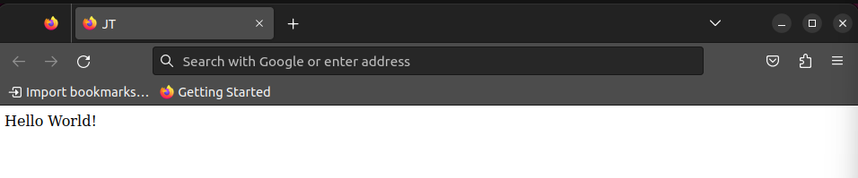
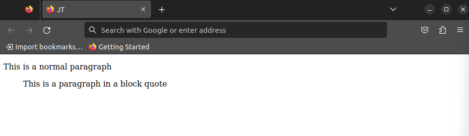
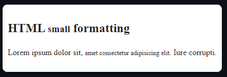
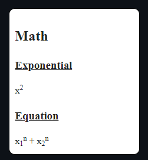
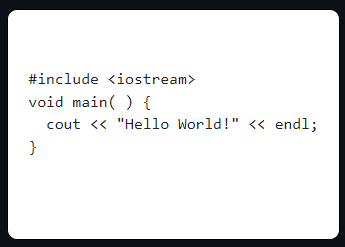
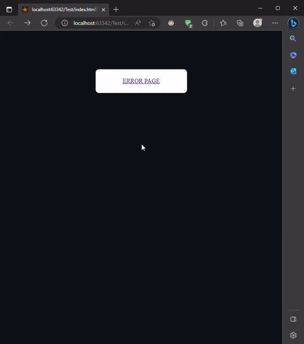
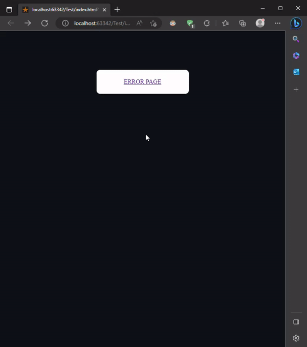
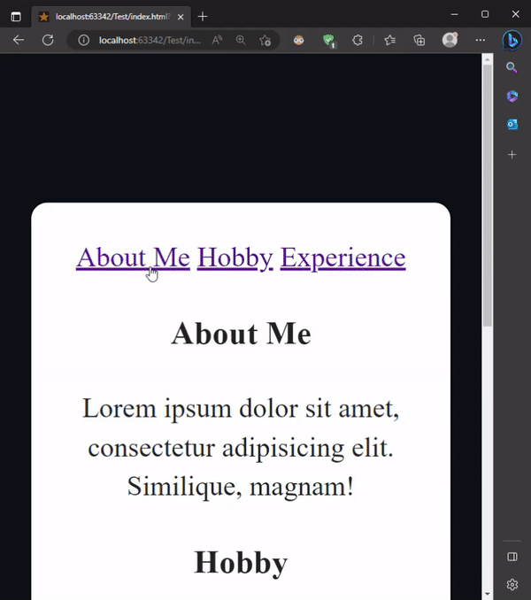

# HTML INTRODUCTION
[<kbd><b>WHAT IS HTML</b></kbd>](https://github.com/BensonNgu/HTML-notes/tree/main/Html-intro#what-is-html)
[<kbd>TAGS</kbd>](https://github.com/BensonNgu/HTML-notes/tree/main/Html-intro#tags)
[<kbd>CHARACTER ENTITIY</kbd>](https://github.com/BensonNgu/HTML-notes/tree/main/Html-intro#character-entity)
[<kbd>BLOCKQUOTE</kbd>](https://github.com/BensonNgu/HTML-notes/tree/main/Html-intro#blockquote)
[<kbd>FORMATTING TEXT</kbd>](https://github.com/BensonNgu/HTML-notes/tree/main/Html-intro#formatting-text)
[<kbd>PREFORMATTED TEXT</kbd>](https://github.com/BensonNgu/HTML-notes/tree/main/Html-intro#preformatted-text)
[<kbd>COMPUTER CODE</kbd>](https://github.com/BensonNgu/HTML-notes/tree/main/Html-intro#computer-code)
[<kbd>IMAGE</kbd>](https://github.com/BensonNgu/HTML-notes/tree/main/Html-intro#image)
[<kbd>LINK</kbd>](https://github.com/BensonNgu/HTML-notes/tree/main/Html-intro#link)
## WHAT IS HTML?
- **H**yper **T**ext **M**arkuo **L**anguage
- Markup language for describing web documents
- described by html tags
- Each tag described different document content

```
<html>
    <head>
        <title>JT</title>
    </head>
    <body>
        Hello World!
    </body>
</html>
```


***A html document***
- start with: \<html> tag
- follow by : \<head> tag   
- follow by : \<body> tag  (visible part in the browser)  

[<kbd>Back to top</kbd>](https://github.com/BensonNgu/HTML-notes/tree/main/Html-intro#html-introduction)

---
## Tags
- most of the tag goes in pair, a start tag and an end tag  
```
<tagname> content </tagname>
```
| **Tags** | **Example** |
|---------|--------|
| Heading | ```<h1> <h2> <h3> <h4> <h5> <h6>``` |
| Paragraph | ```<p>``` |
| Line break | ```<br/> or <bt />``` |
| Horizontal line(divider) | ```<hr/>``` |

[<kbd>Back to top</kbd>](https://github.com/BensonNgu/HTML-notes/tree/main/Html-intro#html-introduction)

---
## Character entity
- Enable the browser to print some character that has been **reserved** by html

| **Character entity** | **Example** |
|---|---|
| Non-breaking space | ```&nbsp``` |
| < | ```&lt``` |
| > |```&gt```|
| & |```&amp```|
| " |```&quot```|
| ' |```&apos```|
| &deg; |```&deg```|
| &copy; |```&copy```|

[<kbd>Back to top</kbd>](https://github.com/BensonNgu/HTML-notes/tree/main/Html-intro#html-introduction)

---
## Blockquote
```
<body>
    <p>This is a normal paragraph</p>
    <blockquote>
        <p>This is a paragraph in a block quote</p>
    </blockquote>
</body>
```


[<kbd>Back to top</kbd>](https://github.com/BensonNgu/HTML-notes/tree/main/Html-intro#html-introduction)

---
## Formatting text
```
<body>
    <i>italic text</i> <br />
    <b>italic text</b> <br />
    <mark>italic text</mark> <br />
    <del>italic text</del> <br />
    <ins>italic text<ins> <br />
</body>
```

```
<body>
    <h2>HTML <small>small</small> formatting</h2>
    <p>Lorem ipsum dolor sit, <small>amet consectetur adipisicing elit</small>. Iure corrupti.</p>
</body>
```

```
<body>
    <h2>Math</h2>
    <h3><ins>Exponential</ins></h3>
    x<sup>2</sup> <br />
    <h3><ins>Equation</ins></h3>
    x<sub>1</sub><sup>n</sup> + x<sub>2</sub><sup>n</sup> 
</body>
```


[<kbd>Back to top</kbd>](https://github.com/BensonNgu/HTML-notes/tree/main/Html-intro#html-introduction)

---
## Preformatted text
- <span style="color:#ccb67b">pre</span> element show in [<kbd>monospace</kbd>](https://fonts.google.com/knowledge/glossary/monospaced)
- it preserved the character and the line spacing

```
<body>
   <pre>
       test
                on
 pre
    tag
   </pre>
   <br />
   <p>
       test
                on
 p
    tag
   </p>
</body>
```
><body>


[<kbd>Back to top</kbd>](https://github.com/BensonNgu/HTML-notes/tree/main/Html-intro#html-introduction)

---
## Computer code
```
<body>
    <pre>
      <code>
#include &ltiostream&gt
void main( ) {
  cout &lt&lt "Hello World!" &lt&lt endl;
}
        </code>
    </pre>
</body>
```


[<kbd>Back to top</kbd>](https://github.com/BensonNgu/HTML-notes/tree/main/Html-intro#html-introduction)

---
## Image
``````
|Attribute|Description|
|---|---|
|```src```|URL of image<br><b><ins>Relative</ins></b> (point to an image within the website)<br>```src="logo.png"```<br>```src="images/logo.png"```<br><b><ins>Absolute</ins></b> (point to another website)<br>```src="https://myWebsite/src/logo.png"```|
|```alt```|alternate text for image <br>It will be shown when image can't be loaded<br>It will also shown when user disabled the image display to save bandwidth<br>A [<kbd>screen reader</kbd>](https://www.emizentech.com/blog/what-is-a-screen-reader.html)will read the alt text to us|
|height & weight|optional<br>both can be specified in pixels```px``` ,or in percentage```%```|

[<kbd>Back to top</kbd>](https://github.com/BensonNgu/HTML-notes/tree/main/Html-intro#html-introduction)

---

## Link
Target Absolute URL   
```<a href="http://www.uow.edu.au" target="_blank">Visit UOW</a>```  
Target Relative URL  
```<a href="contact.html">Contact us</a>```
|Target|Description|Video|
|---|---|---|
|```_blank```|open link in a new window or tab||
|```_self```|open link in the same frame||

Target Within Document  
```
<body>
    <a href="#about-me">About Me</a>
    <a href="#hobby">Hobby</a>
    <a href="#experience">Experience</a>


    <h3 id="about-me">About Me</h3>
    Lorem ipsum dolor sit amet, consectetur adipisicing elit. Similique, magnam!

    <h3 id="hobby">Hobby</h3>
    Lorem ipsum dolor sit amet, consectetur adipisicing elit. Similique, magnam!

    <h3 id="experienc">Experience</h3>
    Lorem ipsum dolor sit amet, consectetur adipisicing elit. Similique, magnam!
</body>
```


[<kbd>Back to top</kbd>](https://github.com/BensonNgu/HTML-notes/tree/main/Html-intro#html-introduction)

---